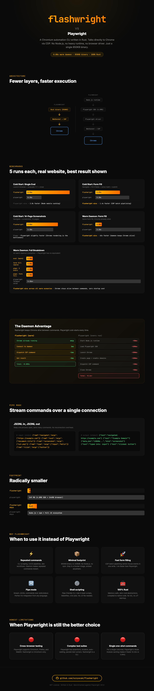

# flashwright

A fast Chromium automation CLI written in Rust.



Talks directly to Chrome via the Chrome DevTools Protocol over a hand-rolled WebSocket client. No Node.js, no heavy dependencies, no browser driver. Just a single 850KB binary.

## Build

```sh
git clone https://github.com/ozzyocak/flashwright.git
cd flashwright
cargo build --release
```

The binary is at `target/release/flashwright`.

Or install directly:

```sh
cargo install --path .
```

## Run

```sh
# single commands
flashwright navigate https://example.com
flashwright eval "document.title"
flashwright screenshot out.png
flashwright click "button#submit"
flashwright type "input[name=email]" "hello@example.com"
flashwright title
flashwright content
```

### Script mode

Run multiple commands in a single browser session:

```sh
flashwright script my.script
```

Script syntax (one command per line, `#` for comments):

```
navigate https://example.com
wait h1
eval "document.querySelector('h1').textContent"
screenshot out.png
```

### Daemon mode

flashwright keeps Chrome alive between commands using a background daemon. The first command auto-starts it. Subsequent commands reuse the same browser with near-zero overhead.

```sh
flashwright eval "1+1"          # first call: starts daemon + Chrome (~1s)
flashwright eval "2+2"          # warm: ~0.005s
flashwright navigate https://example.com  # warm: ~0.1s
flashwright stop                # stop daemon
```

### Pipe mode

Stream JSONL commands over a single connection:

```sh
printf '%s\n' \
  '{"cmd":"navigate","args":["https://example.com"]}' \
  '{"cmd":"eval","args":["document.title"]}' \
  '{"cmd":"title"}' \
  | flashwright pipe
```

### Options

```
--chrome <path>   Path to Chrome executable
--headed          Show browser window
--timeout <ms>    Wait timeout (default 30000)
--viewport <WxH>  Set viewport size
```

## Commands

| Command | Description |
|---|---|
| `navigate <url>` | Go to URL |
| `eval <expr>` | Evaluate JavaScript, print result |
| `click <selector>` | Click element matching CSS selector |
| `type <selector> <text>` | Focus element and type text |
| `screenshot [file] [fmt]` | Capture screenshot (png or jpeg) |
| `pdf [file]` | Print page to PDF |
| `wait <selector>` | Wait for element to appear |
| `title` | Print page title |
| `content` | Print page HTML |
| `script <file>` | Run script file |
| `pipe` | Stream JSONL commands over one connection |
| `serve` | Start daemon manually |
| `stop` | Stop daemon |

## Requirements

- A Chromium-based browser (Chrome, Chromium, Edge, Brave)
- Rust 1.70+

## License

MIT
